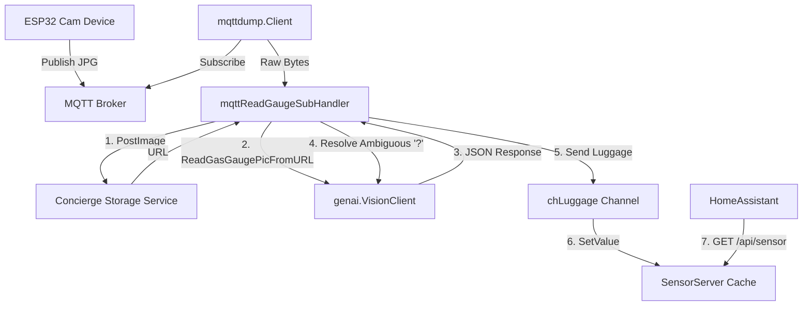

# MQVision - Agent Guide

This document provides system architecture, data flow details, code layouts, and development guidelines for AI agents working on this project.

---

## 1. Project Overview

MQVision is a Go application designed to digitize analog gas meter values by analyzing raw images.
- Main device: A camera device such as [esp32_cam2mqtt](https://github.com/suapapa/esp32_cam2mqtt) publishes gas meter images to an MQTT topic.
- Main pipeline:
  1. Receive raw image bytes from the MQTT topic.
  2. Upload raw images to the Concierge storage service ([Concierge](https://github.com/suapapa/concierge)) to obtain a public URL.
  3. Send the image URL to an AI vision model (currently gpt-4o-mini via OpenAI-compatible API is active) to extract the meter reading and timestamp in JSON.
  4. If reading contains ambiguous digits (returned as ?), use the previous reading as reference to infer the missing digit.
  5. Cache results in memory and expose them via a Gin web server (/api/sensor, /api/sensors, and /api/health endpoints).
  6. HomeAssistant RESTful integration periodically queries the endpoint to collect readings.

---

## 2. System Architecture and Data Flow

The flow of images from the ESP32 camera to HomeAssistant is:

---

## 3. Code Tour

### Root Files
- [main.go](file:///Users/suapapa/ws_suapapa/mqvision/main.go): Application entry point. Loads config, initializes clients, subscribes to MQTT, spins up the Gin web server, and manages channel traffic via chLuggage. Handles graceful shutdown.
- [config.go](file:///Users/suapapa/ws_suapapa/mqvision/config.go): Loads configuration from config.yaml into the Config struct.
- [server.go](file:///Users/suapapa/ws_suapapa/mqvision/server.go): Exposes GET /api/sensor, GET /api/sensors, and GET /api/health HTTP endpoints via Gin. Implements SensorServer with sync.RWMutex.
- [multi_writer_pipe.go](file:///Users/suapapa/ws_suapapa/mqvision/multi_writer_pipe.go): Duplicates output writer streams (currently unused).
- [config.yaml](file:///Users/suapapa/ws_suapapa/mqvision/config.yaml): Prompt-only configuration (system/user instructions for the vision model).
- [.env.example](file:///Users/suapapa/ws_suapapa/mqvision/.env.example): Sample environment variables for MQTT, Concierge, and OpenAI-compatible API credentials.

### Internal Packages
- [internal/concierge/concierge.go](file:///Users/suapapa/ws_suapapa/mqvision/internal/concierge/concierge.go): Client implementation for the Concierge storage service. Uses multipart form posts.
- [internal/mqttdump/mqttdump.go](file:///Users/suapapa/ws_suapapa/mqvision/internal/mqttdump/mqttdump.go): Wrapper for Eclipse Paho Go MQTT client, supporting auto-reconnection.
- [internal/genai/genai.go](file:///Users/suapapa/ws_suapapa/mqvision/internal/genai/genai.go): Core VisionClient interface and GasMeterReadResult struct definition.
- [internal/genai/chars.go](file:///Users/suapapa/ws_suapapa/mqvision/internal/genai/chars.go): Helper logic to check character patterns.
- [internal/genai/openaicompat/openaicompat.go](file:///Users/suapapa/ws_suapapa/mqvision/internal/genai/openaicompat/openaicompat.go): Active implementation of VisionClient using an OpenAI-compatible vision completion endpoint.
- [internal/genai/googleai/googleai.go](file:///Users/suapapa/ws_suapapa/mqvision/internal/genai/googleai/googleai.go): Alternative implementation of VisionClient using Google Gemini API via Genkit (present but currently commented out in main.go).

---

## 4. Core Design Decisions

### OpenAI-Compatible Client Enabled by Default
The newVisionClient function in main.go instantiates openaicompat.Client. The Google Gemini API implementation (googleai.Client) is currently commented out. To switch back, adjust newVisionClient.

### Disambiguation of Digits
When dial divisions are half-rotated, the vision model might return a string with ? representing ambiguous digits (e.g. 0292?.457). The Client calls guessAmbiguousDigits to ask the model to predict the missing digits, passing the previous successful reading as context.

### Concurrent Pipeline
The MQTT message subscriber runs concurrently, handing raw bytes off to the mqttReadGaugeSubHandler goroutine. It uploads to Concierge, queries the AI, and forwards the Luggage payload to the chLuggage channel. A main receiver loop reads this channel and invokes SensorServer.SetValue.

---

## 5. Execution and Testing

### Build
go build -o mqvision

### Configure secrets
cp .env.example .env
# Edit .env: MQTT_*, CONCIERGE_*, OPENAI_*

### Run (MQTT monitoring and Gin web server)
./mqvision -p 8080 -c config.yaml
- p: Specify port (default 8080)
- c: Path to prompt config file (default config.yaml)
- Secrets come from environment / `.env` (MQTT_*, CONCIERGE_*, OPENAI_*)

### Single-shot testing mode (Test vision analysis on local image)
./mqvision -i sample/gauge_20251107_051332.jpg -c config.yaml
- i: Path to a local JPG file. When supplied, mqvision processes only this image, posts it to Concierge, performs vision analysis, updates the SensorServer cache, and then starts the Gin web server.

---

## 6. Guidelines for Future Agents

1. Go Version: Built with Go 1.25.0. Ensure compatibility when editing.
2. Thread Safety: Lock the SensorServer instance using sync.RWMutex before reading or writing values.
3. Context Propagation: Pass contexts properly through client wrappers to support cancellation.
4. Testing: Run tests. Always include table-driven tests when introducing parsing utilities.
5. Legacy Code Preservation: Keep commented out Google AI codes unless explicit removal is requested.
